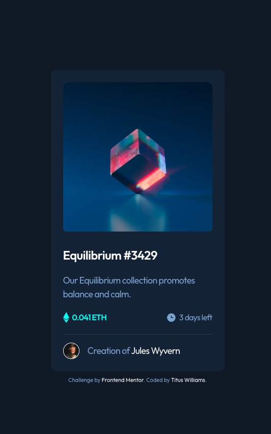

# Frontend Mentor - NFT preview card component solution

This is a solution to the [NFT preview card component challenge on Frontend Mentor](https://www.frontendmentor.io/challenges/nft-preview-card-component-SbdUL_w0U). Frontend Mentor challenges help you improve your coding skills by building realistic projects. 

## Table of contents

- [Overview](#overview)
  - [The challenge](#the-challenge)
  - [Screenshot](#screenshot)
  - [Links](#links)
- [My process](#my-process)
  - [Built with](#built-with)
  - [What I learned](#what-i-learned)
  - [Continued development](#continued-development)
- [Author](#author)

## Overview

### The challenge

Users should be able to:

- View the optimal layout depending on their device's screen size
- See hover states for interactive elements

### Screenshot



### Links

- Solution URL: [Challenge solution](https://www.frontendmentor.io/solutions/nft-preview-card-component-mv08d9H-R_)
- Live Site URL: [Live site](https://transcendent-toffee-c262a7.netlify.app)

## My process

### Built with

- CSS custom properties
- Flexbox
- CSS Grid
- Mobile-first workflow

### What I learned

Was able to learn and practice overlaying images and how to center the overlay. I learned how to put focus state on an image by using the tabindex attribute...

```html
<a href="#" target="_blank"></a>
```
I also wanted to use this project to practice using CSS grid. I found grid much easier for this type of layout as opposed to using flexbox. However, I did use flexbox for div class=price-time.

### Continued development

I would like to continue practicing overlaying images.

## Author

- Frontend Mentor - [@wtwilliams310](https://www.frontendmentor.io/profile/wtwilliams310)


